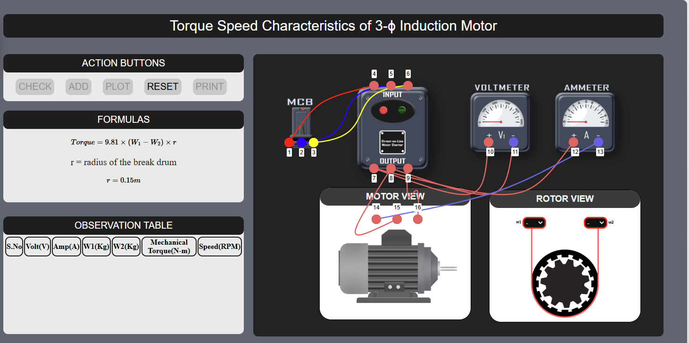

### Steps to perform experiment

<b> Step 1 :</b>  Make connections as per the instructions given below: 
<b>i.	(1-4), (2-5), (3-6) 
ii.	(7-10), (8-11) 
iii.(7-12), (13-14) 
iv.	(8-15), (9-16) </b>
<b>Note: Click on the label to delete the connection for the corresponding node.</b> 

  

<b>Step 2:</b>	Now, Check the connections by clicking on <b>‘CHECK’</b> button. 
<b>Step 3:</b> Turn on the MCB. 
<b>Step 4:</b> Vary the values of W1 and W2 and add readings to observation table by clicking on <b>'ADD'</b> button. 
<b>Step 5:</b> Take atleast 6 readings in observation table. 
<b>Step 6:</b> Click on the <b>‘PLOT’</b> button to plot the graph. 
<b>Step 7:</b> Click on the <b>‘PRINT’</b> button to takeout the print of the webpage. 
<b>Step 8:</b> Click on <b> 'RESET'</b> to reset the webpage. 

 
