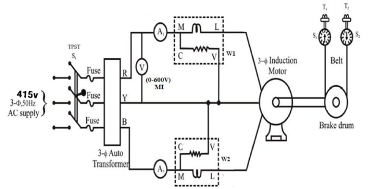
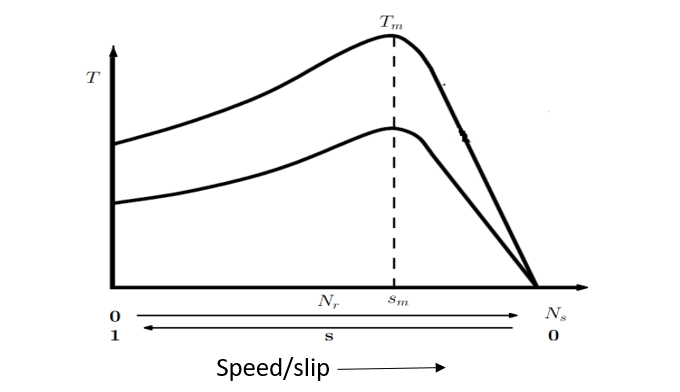
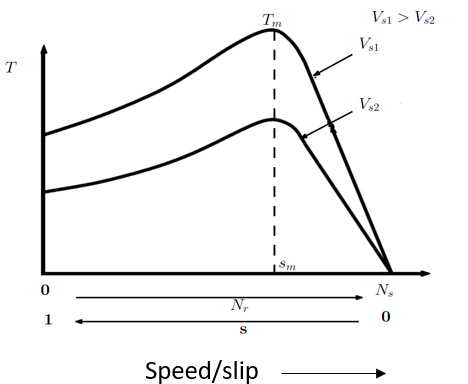
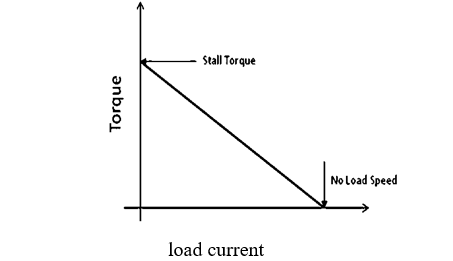

# Torque speed characterstics of three phase Induction Motor 

### Introduction

An induction motor compared to a dc motor has some major advantages such as absence of brushes, commutator segments, rugged construction, being cheap, lesser maintenance requirements and smaller size for the same power output. Due to these advantages induction machines have become more popular in industrial applications. For any motor load application, it is imperative to know the torque speed characteristic of the motor.

Figure 1: 3-phase Induction motor

Consider a three phase squirrel cage induction motor whose stator has three windings displaced in space by 120°. When they are excited with currents that are displaced in time by 120°, a rotating magnetic field rotating at a speed called synchronous speed Ns is set up. The synchronous speed, Ns is given by (1).

 $N_s= \frac {120f} {P}$..........(1)  

where, f is the frequency and P is the number of poles. If the rotor of the induction motor rotates at a speed, Nr, then the slip, s is defined by (2).

 $s= \frac {N_s–N_r} {N_s}$..........(2)      

The torque developed by the induction motor is given by (3)

 $T= \frac {3(IR)^2 R^2} {W_s \cdotS}$ 

 $T= \frac {3}{W_s}  \frac {(V_s)^2 \frac {R2}{S}} { (R1+\frac {R2} {S})^2+(X1+X2)^2 }$.......(3)     

where, Ws is the synchronous speed in rps, Vs is the voltage applied to the stator, I~2~, R~2~, X~2~ are the rotor current, resistance and reactance referred to stator respectively. R~1~, X~1~ are the stator resistance and reactance respectively. If equation (3) is plotted, we get the T-Nr characteristics as shown in Fig. 1. The maximum torque developed, Tm and the slip, Sm at which Tm occurs is given by (4).

 $T_m= \frac {3} {2W_s} \frac {(V_s)^2} {R1\pm\sqrt{R1^2\pm(X1+X2)^2}}$ 

 $S_m=\frac {R2} {\sqrt{R2^2+(X1+X2)^2}}$  

 $S_m ∝ R2$ 

T-Nr characteristics with variable stator voltage. If voltage applied to the stator of the induction motor is varied, developed torque will vary within a relation.

 $T∝ (V_s)^2........(4)$  

The maximum torque developed, Tm is also proportional to square of the applied voltage as in eq.(4), but Sm is independent of applied voltage. So, if the T-Nr characteristics is plotted for different voltages, we get the characteristics as shown in Fig. 2

<!--  -->
Figure 2: T-Nr characteristics of a three phase induction motor 

 

Figure 3: T-Nr characteristics of a three phase induction motor
with variable voltage control

The torque-speed characteristics of a three-phase induction motor is a straight line between the no-load and full-load operating points. The slope of the curve line depends upon the resistance of the rotor circuit i.e. the higher the rotor circuit resistance, the sharper the slope of the curve.

If weight of load on rotating pully in induction motor are W1 & W2. Then the torque of induction motor is

 $T=(W1 - W2)*9.81*r$    ..........(5)  

 

 Where, r = radius of brake drum (r=0.15m) 

Figure 4: Plot between Torque and Load current

### Advantages of Three phase Induction motor

* The most important advantage of an induction motor is that its construction is quite   simple in nature.

* The working of the motor is independent of the environmental condition. This is because the induction motor is Robust and mechanically strong.

* Due to the absence of brushes, there are no sparks in the motor. It can also be operated in hazardous conditions.

*  An induction motor is a highly efficient machine with full load efficiency varying from 85 to 97 percent.

### Disadvantages of Three phase Induction motor

 *  Speed control of an induction motor is very difficult to attain. This is because a 3 phase induction motor is a constant speed motor and for the entire loading range, the change in speed of the motor is very low.

 *  Induction motors have high input surge currents, which are referred to as Magnetizing Inrush currents. This causes a reduction in voltage at the time of starting the motor.

 *  Due to poor starting torque, the motor cannot be used for applications which require high starting torque.

