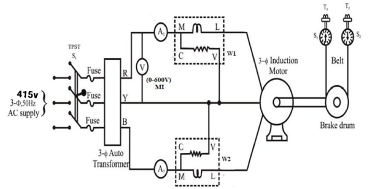
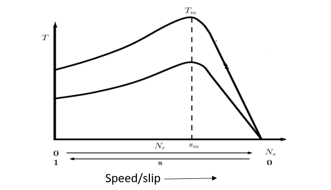
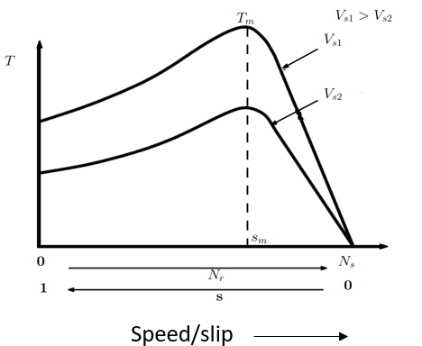
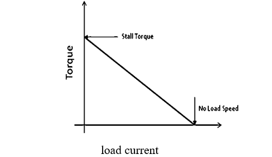

<head>

</head>

### Introduction

An induction motor compared to a DC motor has some major advantages such as the absence of brushes, commutator segments, rugged construction, being cheap, lesser maintenance requirements, and smaller size for the same power output. Due to these advantages, induction machines have become more popular in industrial applications. For any motor load application, it is imperative to know the torque-speed characteristic of the motor.

 
  
Figure 1: 3-phase Induction motor

Consider a three-phase squirrel cage induction motor whose stator has three windings displaced in space by 120°. When they are excited with currents that are displaced in time by 120°, a rotating magnetic field rotating at a speed called synchronous speed Ns is set up. The synchronous speed Ns is given by equation (1).

  
 $$N_s = \frac{(120)f}{P}.............. (1)$$  

where f is the frequency and P is the number of poles. If the rotor of the induction motor rotates at a speed Nr, then the slip S is defined by equation (2).

 
 $$S = \frac{N_s - N_r}{N_s}.........(2)$$ 

The torque developed by the induction motor is given by equation (3).

 
 $$T = \frac{3 I_2^2 R_2}{W_s.s}$$ 

 
 $$T = \frac{3}{W_s}.\frac{V_s^2.\frac{R_2}{s}}{\left(R_1 + \frac{R_2}{s}\right)^2 + \left(X_1 + X_2\right)^2}............(3)$$   

where Ws is the synchronous speed in rpm, Vs is the voltage applied to the stator, I2, R2, X2 are the rotor current, resistance, and reactance referred to the stator respectively, and R1, X1 are the stator resistance and reactance respectively. If equation (3) is plotted, we get the T−Nr characteristics as shown in Fig. 1. The maximum torque developed Tm and the slip Sm at which Tm occurs is given by equation (4).

 
 $$T_m = \frac{3}{2W_s}.\frac{V_s^2}{R_1 \pm \sqrt{R_1^2 \pm \left(X_1 + X_2\right)^2}} ...........(4)$$ 

 
 $$S_m = \frac{R_2}{\sqrt{R_2^2 + \left(X_1 + X_2\right)^2}}$$ 

 
 $$S_m \propto R_2$$   

If the voltage applied to the stator of the induction motor is varied, the developed torque will vary according to the relation:

 $$T \propto V_s^2 ..........(5)$$ 

The maximum torque developed Tm is also proportional to the square of the applied voltage as in equation (5), but 
Sm is independent of the applied voltage. So, if the T−Nr characteristics are plotted for different voltages, we get the characteristics as shown in Fig. 2.

  
Figure 2: T−Nr characteristics of a three-phase induction motor
  

  
Figure 3: T−Nr characteristics of a three-phase induction motor with variable voltage control

 

The torque-speed characteristics of a three-phase induction motor are a straight line between the no-load and full-load operating points. The slope of the curve depends upon the resistance of the rotor circuit i.e., the higher the rotor circuit resistance, the sharper the slope of the curve.

If the weight of the load on the rotating pulley in the induction motor is W1 & W2, then the torque of the induction motor is given by equation (6).

$$T = (W_1 - W_2)\cdot 9.81\cdot r ........(6)$$ 

 Where (r) = radius of brake drum (r = 0.15m)  
  
Figure 4: Plot between Torque and Load current

### <b>Advantages of Three-phase Induction Motor: </b>

1. The most important advantage of an induction motor is its simple construction.

2. The working of the motor is independent of environmental conditions because the induction motor is robust and mechanically strong.

3. Due to the absence of brushes, there are no sparks in the motor. It can also be operated in hazardous conditions.

4. An induction motor is a highly efficient machine with full-load efficiency varying from 85 to 97 percent.

### <b>Disadvantages of Three-phase Induction Motor: </b>

1. Speed control of an induction motor is very difficult to attain. This is because a three-phase induction motor is a constant-speed motor, and for the entire loading range, the change in speed of the motor is very low.

2. Induction motors have high input surge currents, referred to as magnetizing inrush currents, which cause a reduction in voltage at the time of starting the motor.

3. Due to poor starting torque, the motor cannot be used for applications requiring high starting torque.

